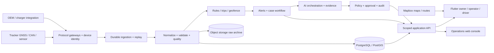
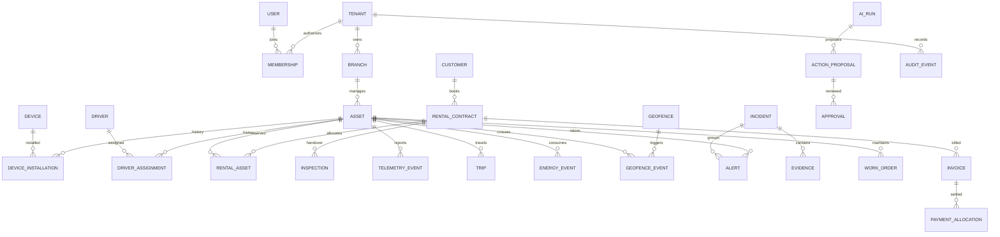

# RevTrack

**Armada terkendali. Operasi lebih cepat. Keputusan berbasis bukti.**

RevTrack dirancang menjadi platform operasi rental dan telematika B2B untuk kendaraan bensin, EV, dan—bertahap—alat berat. Flutter untuk Android/iOS, Mapbox untuk pengalaman peta, perangkat IoT untuk data kendaraan, dan tim AI untuk membantu operator menangani ribuan unit.

Dokumen ini adalah blueprint produk dan engineering, disusun **2 Oktober 2026**. Tujuannya membuat software dan data armada berada dalam kendali RevTrack, sambil tetap menggunakan perangkat, konektivitas, dan layanan peta yang dapat dipertanggungjawabkan.

> **Status: aplikasi mobile Flutter + backend Go yang dapat dijalankan sebagai demo fullstack, belum layanan produksi.** Data awal aplikasi/API adalah simulasi. Belum ada tracker fisik, kontrak OEM EV, billing, akun produksi, panggilan ke kendaraan, atau kontrol kendaraan yang tersambung. Fitur target di bawah tidak otomatis berarti sudah diimplementasikan. Lihat [cakupan kode](#19-cakupan-kode-dan-cara-menjalankan).

## 1. Keputusan utama

1. **Mulai dari rental B2B milik sendiri**, validasi di armada kecil, lalu jual sebagai SaaS multi-tenant. Marketplace seperti Grab menjadi tahap terpisah setelah operasi armada stabil.
2. **Bangun software sendiri; beli tracker bersertifikasi untuk pilot.** Kebebasan dari vendor fullstack tidak mengharuskan membuat PCB, modem, dan firmware sekaligus.
3. **Gunakan Flutter + Mapbox untuk mobile.** Data GPS berasal dari GNSS tracker/ponsel; Mapbox menampilkan peta dan menyediakan layanan lokasi/rute. Token Mapbox bukan pengganti perangkat GPS.
4. **Mulai dengan modular monolith dan ingestion terpisah.** PostgreSQL + PostGIS sebagai fondasi; komponen streaming dan penyimpanan analitik ditambah ketika pengukuran membutuhkannya.
5. **AI mengusulkan tindakan berbukti.** Aturan deterministik menangani keselamatan, otorisasi, dan batas biaya. Tidak ada akses langsung model ke relay, shell produksi, transfer uang, atau database tanpa pembatasan.
6. **Kompatibilitas kendaraan harus diuji per model/tahun/varian.** Persen EV, level bensin, odometer asli, dan status pengisian tidak tersedia universal dari satu tracker.
7. **Keamanan berlapis, dengan jalur pemulihan insiden.** Targetnya mengurangi risiko dan mempercepat respons; tidak ada sistem yang menjamin mobil mustahil dicuri.

Asumsi perencanaan sementara: pilot **20–50 unit di Jabodetabek**, campuran EV dan bensin, target desain **10.000 unit**. Angka ini belum merupakan kapasitas yang sudah dibuktikan lewat load test.

## 2. Peta dokumen

| Dokumen | Isi |
|---|---|
| [README ini](README.md) | Strategi, requirement, UX, roadmap, komersialisasi, cara menjalankan |
| [IoT dan keamanan kendaraan](docs/02-iot-security.md) | Pilihan perangkat, CAN/EV/fuel, tamper, interkom, instalasi, pengujian lapangan |
| [Arsitektur dan ERD](docs/03-architecture-erd.md) | Batas modul, alur telemetri, entitas, relasi, isolasi tenant, API |
| [Tim AI dan workflow operasi](docs/04-ai-operations.md) | Sub-agent, tool permissions, approval, evaluasi, contoh kasus |
| [Pilot dan backlog peluncuran](docs/05-pilot-delivery.md) | Persiapan, acceptance criteria, prioritas engineering, keputusan yang masih terbuka |
| [Engineering backend dan DSA](docs/07-backend-engineering.md) | Go, Rust, Python, C++/C; algoritma, concurrency, kontrak, profiling dan pengujian |
| [Flutter](apps/mobile/) | Aplikasi Android/iOS dan Mapbox native |
| [Panduan menjalankan](docs/08-demo-walkthrough.md) | Launcher mobile, konfigurasi lokal dan alur presentasi |
| [Catatan verifikasi](docs/06-verification.md) | Hasil pemeriksaan aktual dan batas yang belum diuji |
| [API](services/api/) | API demo lokal dan pengujian ingestion |
| [Database](db/) | Fondasi skema PostgreSQL/PostGIS; bukan seluruh modul komersial |

## 3. Siapa yang memakai RevTrack?

| Pengguna | Pekerjaan utama | Akses utama |
|---|---|---|
| Pemilik / direktur | Mengetahui utilisasi, risiko, pendapatan, biaya, kesehatan armada | Ringkasan bisnis dan drill-down berbasis cabang |
| Dispatcher / operator | Mencari unit, mengatur driver, menindaklanjuti alert | Peta, penugasan, insiden, komunikasi |
| Supervisor keamanan | Menilai bukti, memimpin respons kehilangan, menyetujui tindakan sensitif | Kasus, bukti, approval, audit |
| Finance | Menagih rental, rekonsiliasi BBM/charging, deposit dan kerusakan | Invoice, biaya, transaksi; lokasi seperlunya |
| Maintenance / teknisi | Instalasi tracker, inspeksi, service, diagnosis | Health perangkat dan work order |
| Driver | Menerima tugas, inspeksi, log perjalanan, laporan, bantuan | Kendaraan/tugas yang sedang diotorisasi |
| Pelanggan rental korporat | Memantau armada kontraknya dan SLA | Hanya kendaraan dan periode kontrak yang diizinkan |
| Admin SaaS RevTrack | Onboarding tenant, langganan, support | Akses support terbatas waktu, beralasan, dan tercatat |

Izin mengikuti **tenant + cabang + peran + kendaraan + periode penugasan**. Mengetahui ID kendaraan tidak memberikan hak untuk melihat lokasinya.

## 4. Requirement end-to-end

**P0:** pilot operasi nyata. **P1:** siap dijual ke beberapa tenant. **P2:** diferensiasi dan optimasi. **P3:** ekosistem/marketplace. Semua baris merupakan target produk, kecuali disebut sebagai starter.

| Modul | Kebutuhan | Prioritas | Ukuran keberhasilan / batas |
|---|---|---|---|
| Organisasi dan akses | Tenant, cabang, tim, MFA, peran, undangan, audit | P0 | Uji akses lintas tenant wajib gagal |
| Asset registry | Kendaraan, VIN terbatas akses, nopol, kepemilikan, dokumen, tanggal kedaluwarsa | P0 | Riwayat perubahan dan penggantian unit |
| Device lifecycle | IMEI/serial, SIM, instalasi, binding, firmware, servis, decommission | P0 | Perangkat tidak dapat mengklaim tenant lewat payload |
| Fleet map | Posisi terakhir, waktu ukur/terima, akurasi, bergerak/idle/parkir/offline | P0 | Posisi lama tidak ditampilkan seolah posisi saat ini |
| Trip dan playback | Start/stop, jalur, berhenti, jarak, speed, exception | P0 | Gap jaringan terlihat; interpolasi diberi label |
| Geofence | Polygon/circle, area larangan/izin, jadwal, dwell, entry/exit | P0 | Hysteresis dan deduplikasi menghindari alert berulang |
| Driver | Profil, dokumen, assignment, shift, rating berbukti, hak klarifikasi | P0 | Tidak ada dua assignment aktif yang bentrok |
| Rental | Booking, availability, kontrak, deposit, serah-terima, extend, return | P0→P1 | Bentrok booking dicegah secara transaksi |
| Inspeksi | Foto, checklist, odometer, kondisi energi, tanda tangan, kerusakan | P0 | Timestamp, aktor, versi, lokasi opsional berizin |
| Alert dan kasus | Severity, acknowledgement, assignment, escalation, resolution | P0 | Setiap alert kritis memiliki owner dan SLA |
| Fraud review | Bukti gabungan tracker, kendaraan, driver, pembayaran | P0→P2 | Temuan merupakan indikasi untuk investigasi |
| BBM | Level, consumption, refuel/drain, nota, biaya per km | P0 terbatas | Hanya pada unit dengan sensor/CAN tervalidasi |
| EV | SOC, charging, perkiraan range, biaya energi; SOH bila tersedia | P0 terbatas | Kemampuan dicatat per unit; nilai tidak ada = unknown |
| Maintenance | Jadwal km/jam/tanggal, DTC jika tersedia, work order, parts | P1 | Availability memperhitungkan service dan downtime |
| Finance | Invoice, recurring billing, credit note, deposit ledger, rekonsiliasi | P1 | Ledger tidak ditimpa; webhook pembayaran idempotent |
| Report | Harian/mingguan, driver, trip, idle, fuel/energy, biaya, audit export | P0→P1 | Filter tenant/cabang/periode dan export tercatat |
| Integrasi | API, signed webhooks, ERP/accounting, charging/payment provider | P1 | Retry, idempotency, pembatasan akses dan kuota |
| Interkom | Pesan suara/push-to-talk ke unit berperangkat audio | P1 pilot | Indikator audible, autentikasi, log; lihat ketentuan IoT |
| AI Copilot | Ringkasan shift, prioritas insiden, usul dispatch dan service | P1 | Bukti dapat dibuka; aksi sensitif perlu persetujuan |
| Alat berat | Engine hours, lokasi proyek, PTO/operating state bila tersedia | P2 | Profil asset berbeda; jangan memaksakan skema mobil |
| Marketplace | Matching penumpang-driver, tarif, payment, trust/safety | P3 | Produk dan model bisnis terpisah dari fleet SaaS |

### Alur rental yang wajib tersambung

`Lead → quotation → booking → pengecekan availability → kontrak/deposit → inspeksi keluar → assignment → perjalanan/monitoring → extend atau return → inspeksi masuk → biaya akhir → invoice/settlement → service → tersedia kembali`.

Cancellation, no-show, pergantian driver, perpindahan cabang, kecelakaan, unit pengganti, sengketa biaya, dan kendaraan hilang adalah alur resmi, bukan catatan bebas yang tercecer.

### Status kendaraan dan kualitas data

- **Moving:** ada bukti gerak yang cukup; ambang awal contoh >5 km/jam, dikalibrasi pada pilot.
- **Idle:** ignition hidup, gerak rendah, durasi melewati ambang; untuk EV gunakan status ready bila memang tersedia.
- **Parked:** ignition/ready mati dan bukti berhenti cukup.
- **Offline/stale:** heartbeat melewati batas profil pelaporan; jangan menyimpulkan parkir dari paket yang berhenti masuk.
- **Unknown:** perangkat atau parameter tidak mendukung keputusan tersebut.

Simpan `recorded_at`, `received_at`, `source`, `accuracy`, `quality`, `sequence`, dan capability perangkat. Tampilkan kecepatan GNSS terpisah dari kecepatan CAN; jarak kalkulasi GPS terpisah dari odometer kendaraan. Waktu disimpan UTC, ditampilkan sesuai zona cabang (awal Asia/Jakarta).

## 5. Tampilan dan pengalaman pengguna

Ambil inspirasi dari kemudahan Grab, fokus visual Tesla, dan kedalaman operasi fleet management. RevTrack tetap memiliki identitas sendiri: **kanvas putih hangat, navy, aksen biru elektrik, dan font Inter yang dibundel untuk pemakaian offline**. Tipografi regular/medium/semibold, hirarki sederhana, tombol nyaman disentuh, dan animasi ringan menjaga tampilan ramah di layar ponsel. Inter menggunakan lisensi SIL Open Font License; berkas lisensinya tersedia bersama aset font. [Sumber Inter](https://rsms.me/inter/)

### Layar utama

1. **Overview:** unit aktif, perlu perhatian, pemakaian, dan ringkasan shift. Operator bisa langsung membuka masalah terpenting.
2. **Fleet Map:** peta Mapbox, cluster, pencarian nopol/driver, filter status/cabang/powertrain, daftar unit tersinkron dengan marker.
3. **Vehicle 360:** posisi dan umur data, identitas driver, energi, trip, grafik, inspeksi, biaya, riwayat device, incident timeline.
4. **Operations:** booking, assignment, tugas relokasi, jadwal service, kapasitas cabang.
5. **Inbox:** alert yang dikelompokkan menjadi kasus, bukti, prioritas, tindak lanjut, owner.
6. **Copilot:** pertanyaan bahasa Indonesia, jawaban berbukti, usul tindakan, preview dampak, approval.
7. **Driver workspace:** tugas hari ini, navigasi, inspeksi, pelaporan, SOS dan komunikasi; UI sederhana saat berkendara.

### Prinsip UI yang harus teruji

- Bottom navigation di ponsel, navigation rail dan panel terpisah di tablet/desktop.
- Animasi singkat 150–250 ms, hormati pengaturan reduced motion, hindari animasi berat pada ribuan marker.
- Map camera tidak terus meloncat saat operator sedang menelusuri lokasi lain. Mode follow dipilih pengguna.
- Warna selalu ditemani label/ikon. Grafik punya satuan, rentang waktu, sumber data, tooltip dan keadaan kosong.
- Grafik energi tidak menghubungkan gap seolah sensor terus membaca; tidak mengubah unknown menjadi 0%.
- Status offline, loading, izin ditolak, token tidak valid, dan server gagal harus memiliki tampilan yang jelas.
- Target uji: scroll/pan tetap responsif pada perangkat Android menengah; peta memakai clustering/layer, bukan ribuan widget.
- Tombol dengan konsekuensi besar menampilkan preview, alasan dan approval; tidak ada tombol “AI ambil alih semua”.

## 6. IoT: perangkat yang perlu disiapkan

Konfigurasi awal yang disarankan untuk validasi, bukan purchase order:

| Paket | Komponen | Cocok untuk |
|---|---|---|
| Core | Tracker hardwired LTE Cat 1, GNSS, ignition input, backup battery, store-and-forward, accelerometer | Lokasi, perjalanan, geofence, power cut/tow indication |
| Connected vehicle | Core + CAN/OBD interface tervalidasi + wiring harness | Odometer, status kendaraan, EV SOC atau fuel pada model yang mendukung |
| Fuel assurance | Core + sensor level bahan bakar yang sesuai tangki + kalibrasi + nota/transaksi | Kendaraan dengan risiko BBM tinggi; tidak semua mobil cocok retrofit |
| Recovery | Primary tracker + perangkat kedua dengan daya/lokasi pemasangan independen | Unit berisiko tinggi; tetap tidak menjamin sinyal saat jamming |
| Voice | Terminal LTE/VoLTE/PTT atau gateway audio terpisah, speaker, indikator sesi | Komunikasi operasi ke kabin |
| Heavy asset | Perangkat rugged, catu 12/24 V sesuai spesifikasi, input engine hour/CAN J1939 bila didukung | Excavator, genset, kendaraan proyek |

Bandingkan Teltonika, Queclink, atau perangkat setara yang protokolnya terdokumentasi, dapat mengirim ke server sendiri, serta memiliki dukungan distributor lokal. Periksa kemampuan TLS/sertifikat, buffer, penggantian SIM, OTA, dan lisensi konfigurasi **per SKU/firmware**. Jangan menganggap semua tracker mendukung MQTT, interkom, CAN, dan EV sekaligus.

**Mengapa belum membuat tracker sendiri?** Risiko automotive electrical, battery safety, RF, sertifikasi, firmware recovery, pemasangan, dan garansi akan memperlambat validasi produk. Custom hardware baru masuk setelah spesifikasi, volume, dan biaya dukungan terbukti. Rincian kandidat dan sumber resmi ada di [dokumen IoT](docs/02-iot-security.md).

## 7. Mencegah kehilangan dan manipulasi

| Skenario | Bukti yang dicocokkan | Respons produk |
|---|---|---|
| Daya tracker diputus | Tegangan turun, backup aktif, ignition terakhir, perangkat kedua | Alert tamper + kasus, tampilkan posisi terakhir dan umur data |
| Mobil ditarik | Gerak/tilt saat ignition off, jadwal towing resmi | Alert tow indication, verifikasi operasi |
| Keluar wilayah | Geofence, accuracy, dwell, izin perjalanan | Notifikasi bertahap + exception yang tercatat |
| Lokasi dipalsukan / jamming | Lompatan posisi, fix quality, kecepatan tidak masuk akal, ketidaksesuaian sensor | Turunkan trust, beri label indikasi; bukan bukti tunggal pelaku |
| Tracker dipindahkan | Binding instalasi, pola daya/CAN, inspeksi, beacon pasangan jika ada | Buka pemeriksaan perangkat/asset |
| Driver bertukar tanpa izin | Assignment, identitas/check-in, approval pergantian | Minta verifikasi; hindari tuduhan otomatis |
| Klaim isi bensin fiktif | Nota, pembayaran, lokasi/waktu SPBU, delta sensor, tank capacity | Skor ketidaksesuaian + bukti; antrean review finance |
| Pengurasan bensin | Penurunan level stabil saat berhenti, slope/slosh filter, riwayat refuel | Kasus dugaan drain, konfirmasi sensor dan situasi |
| Manipulasi odometer | CAN counter, trip GNSS, inspeksi, reset device | Flag discrepancy; catat sumber tiap pembacaan |
| Penyalahgunaan akun | MFA, sesi/perangkat, perubahan akses, audit | Revoke session dan incident response |

**Kontrol kendaraan:** rancang hanya kontrol yang didukung OEM/perangkat dan telah divalidasi installer. Opsi start-inhibit hanya boleh dievaluasi pada kendaraan berhenti dengan data segar, dual approval, expiry, acknowledgement, dan interlock lokal. Jangan memutus mesin kendaraan bergerak, sistem rem, setir, atau baterai traksi EV. Kode starter tidak mengirim perintah fisik.

**Interkom:** kebutuhan “langsung terdengar tanpa driver mengangkat” dapat dirancang sebagai announcement/PTT pada terminal terpasang, dengan pemberitahuan driver, indikator bunyi/lampu, izin operator dan audit. GPS tracker biasa belum tentu memiliki audio. Jangan mengubahnya menjadi penyadapan kabin tersembunyi; listening/recording memerlukan dasar penggunaan dan pengaturan privasi yang tepat. Validasi dengan penasihat hukum dan vendor sebelum peluncuran.

## 8. EV, BBM, dan grafik yang berguna

### EV

SOC, charging state, kWh, voltage, temperature, dan SOH adalah **capability opsional yang berbeda**. SOC tidak sama dengan kesehatan baterai. OEM API, CAN dongle, dan integrasi charger memiliki keterbatasan serta izin masing-masing.

Target grafik: SOC versus waktu/perjalanan, charging session, energi per 100 km bila kWh tersedia, biaya per km, waktu charging/queue, serta proyeksi kebutuhan energi untuk assignment. Perkiraan range harus menunjukkan asumsi, confidence dan cadangan minimum. Persentase SOC turun saja tidak cukup untuk menghitung energi presisi tanpa kapasitas dan karakteristik baterai.

### BBM

Target grafik: level terkalibrasi, refuel event, dugaan drain, konsumsi per 100 km, idle fuel bila tersedia, nota versus sensor, dan biaya per km. Lokasi di SPBU atau foto nota saja tidak membuktikan bensin benar-benar masuk. Tangki miring, sloshing, resolusi sensor, dan jeda pelaporan dapat memengaruhi delta.

Cartrack sendiri menjelaskan bahwa data fuel bergantung pada CAN yang mendukung atau sensor terpasang; keterbatasan fisik yang sama harus diperlakukan jujur di RevTrack. [Sumber: Cartrack Fuel API](https://developer.cartrack.com/docs/fleet-api/fuel/)

## 9. Arsitektur fullstack target



| Lapisan | Keputusan awal | Alasan / batas |
|---|---|---|
| Mobile | Flutter stable, feature modules, repository interfaces | Android/iOS satu fondasi; owner dan driver dapat dipisah flavor |
| Maps | SDK resmi Mapbox native; style token configurable | Peta, clustering, route preview; lisensi/attribution tetap aktif |
| API bisnis | **Go**, modular monolith, standard HTTP/typed domain, context dan bounded workers | Rental, assignment, akses, billing, API dan realtime; service dipecah berdasarkan kebutuhan terukur |
| Gateway telemetri | **Rust**, adapter per protokol; proses dan port terpisah | Parsing binary TCP/UDP/HTTP/MQTT dengan batas frame dan backpressure; tahap implementasi berikutnya |
| Identity | OIDC provider, MFA, RBAC + scope cabang/asset | Token user dan device merupakan trust boundary berbeda |
| Database | PostgreSQL + PostGIS, partition telemetri berbasis waktu | Relasi bisnis, transaksi, spatial queries; uji volume sebenarnya |
| Delivery event | Transactional outbox; durable broker ketika multi-worker | Konsumen idempotent; retry/DLQ/replay tetap diperlukan |
| Real-time | WebSocket/SSE dengan subscription tenant + viewport | Batasi fan-out; reconnect/snapshot/delta/version |
| Storage | Object storage encrypted, lifecycle dan signed URL | Foto inspeksi, dokumen, raw archive, evidence |
| Workflow | Job queue dahulu; Temporal bila workflow panjang makin kompleks | Approval, timeout, kompensasi, retry dapat diaudit |
| AI / analitik | **Python**, model gateway + tools terbatas + evidence store | Training/evaluasi/anomali/batch; keputusan bisnis tetap lewat API Go |
| Edge / firmware | **C++ / C** sesuai SDK/RTOS; Rust embedded bila ekosistem mendukung | CAN/UART/modem/sensor, watchdog, bounded buffers, signed update; hanya ketika mengembangkan perangkat sendiri |
| Observability | Structured logs, metrics, traces, queue lag, device health | Jangan hanya memonitor HTTP; pantau kelengkapan data armada |

### Pembagian bahasa dan standar engineering

**Go + Rust + Python + C++ adalah arsitektur target sesuai kebutuhan proyek; C ditambahkan untuk firmware/driver IoT.** Tidak semua bahasa perlu berjalan pada hari pertama. Pilot tracker komersial dapat memakai firmware vendor; kita menulis protocol adapter dan server, bukan mengganti firmware yang sudah tersertifikasi.

- **Go:** application API, otorisasi, transaksi rental, orchestrator aturan, live subscriptions, dan device registry. Mulai dari modul `identity`, `fleet`, `rental`, `dispatch`, `incidents`, `maintenance`, `billing`, `integrations`. Gunakan interface pada boundary, dependency injection eksplisit, cancellation/deadline, error terstruktur, dan migration yang bisa ditinjau.
- **Rust:** socket ingestion dan parser protokol, validasi frame/checksum, normalisasi satuan, batching dan bounded queues. Hindari `unsafe` kecuali perlu, terisolasi dan diaudit; parser wajib fuzz test. Memory safety tidak menggantikan autentikasi atau batas resource.
- **Python:** AI agents, evaluasi, feature engineering, forecasting, analitik dan simulator perangkat. Worker mengonsumsi kontrak versi resmi dan memanggil tool API berizin; tidak memiliki akses admin langsung ke sistem kendaraan.
- **C++ / C:** firmware atau gateway edge bila kelak dibangun sendiri: HAL/driver, GNSS/CAN, modem, secure boot/OTA, watchdog, state machine dan penyimpanan offline. Gunakan subset yang terkontrol, static analysis, sanitizer pada host tests, dan hardware-in-the-loop. Fitur C++ harus sesuai toolchain/RTOS; hindari alokasi dinamis tak terbatas pada jalur kritis.
- **Rust embedded:** alternatif hanya setelah dukungan board, HAL, debugger, vendor library, update dan tim terbukti. **Kotlin/Swift** hanya bila Flutter membutuhkan native bridge audio/background/platform; **SQL** untuk skema/query. Tidak perlu menambah service hanya untuk memakai bahasa tertentu.

Internal service memakai kontrak **Protobuf/gRPC atau event schema berversi** sesuai kebutuhan; REST/OpenAPI untuk aplikasi/integrasi, WebSocket/SSE untuk delta armada, protokol vendor di sisi perangkat. Pilihan ini adalah target; starter memiliki REST JSON dan belum mengimplementasikan semua transport.

| Masalah | Struktur data / algoritma | Kompleksitas dan catatan |
|---|---|---|
| Latest state / dedup | Hash map, cursor per device, TTL + kapasitas terbatas | Lookup rata-rata O(1); penyimpanan harus dibatasi, termasuk saat serangan |
| History jendela pendek | Ring buffer per device | Append O(1), memory O(jumlah device × kapasitas) |
| Event terlambat | Watermark + reorder window terbatas; min-heap bila diperlukan | O(log w) insert untuk window w; jangan menahan event selamanya |
| Geofence | Spatial index bounding boxes → exact point-in-polygon | Index menekan kandidat; exact polygon O(v), v jumlah vertex; worst case tetap diukur |
| Cari unit terdekat | GiST/KNN spatial query → routing ETA pada kandidat kecil | Kedekatan garis lurus bukan ETA jalan; hindari semua pasangan N×N |
| Dispatch | Hard constraints dahulu → scoring kandidat → matching/solver | Greedy untuk baseline; optimasi kompleks memiliki timeout dan fallback |
| Alert storm | State machine, hysteresis, cooldown, incident correlation | Event stabil diperlukan; aturan deterministik dapat diuji |
| Report panjang | Partition pruning, indeks sesuai query, agregasi/downsampling | Hindari scan raw telemetry seluruh armada setiap refresh |
| Realtime ribuan unit | Subscription index tenant/viewport + coalescing delta | Bounded queue per client; client lambat tidak menahan ingestion |

Standar yang kita ambil dari engineering skala besar adalah **correctness, bukti performa, observability, batas resource, recovery, dan code review**. Tidak ada klaim “FAANG-grade” hanya karena memakai empat bahasa. Setiap ADR memuat masalah, opsi, trade-off, keputusan, benchmark dan kondisi evaluasi ulang. Target throughput, P95/P99, memory/device, reconnect burst dan biaya/unit harus dibuktikan dengan profil beban, fuzz/property tests, race tests, contract tests, tenant isolation tests, serta restore/chaos drills. Rincian ada di [rancangan backend dan DSA](docs/07-backend-engineering.md).

Mapbox Flutter sudah diperbarui ke **3.0.0 stable** untuk Android/iOS dengan dukungan web melalui paket federated. RevTrack memakai SDK native pada mobile dan integrasi Mapbox GL JS 3.32.0 pada preview web; tanpa token, peta skematik berlabel demo tetap tersedia. [SDK resmi](https://pub.dev/packages/mapbox_maps_flutter)

Logo/attribution serta akses opt-out telemetry Mapbox harus tetap tersedia. Maps SDK tidak otomatis menyediakan seluruh pengalaman turn-by-turn; validasi SDK/platform bridge, voice, offline, harga dan cakupan jalan secara terpisah. [Persyaratan Mapbox](https://docs.mapbox.com/flutter/maps/guides/)

### Kontrak event inti

```json
{
  "schemaVersion": 1,
  "deviceId": "device-provisioned-id",
  "eventId": "device-session-sequence",
  "sequence": 1042,
  "recordedAt": "2026-10-02T01:00:00Z",
  "position": {"latitude": -6.2088, "longitude": 106.8456, "accuracyM": 12},
  "speedKph": 35.2,
  "ignition": true,
  "energy": {"socPercent": 72, "fuelPercent": null},
  "quality": {"source": "can-and-gnss", "fix": "3d"}
}
```

Ini **kontrak target normalisasi**, bukan payload API demo persis. Server menetapkan tenant/asset dari registry dan identitas perangkat; `tenantId` kiriman device tidak dipercaya. Paket duplikat tidak menggandakan trip/alert; paket terlambat dapat masuk sejarah tanpa memundurkan latest state. Session/boot identity harus mengatasi counter reset. API demo mendokumentasikan subsetnya di folder service.

### Kapasitas: hitung sebelum membeli infrastruktur

Contoh semua 10.000 unit mengirim tiap 10 detik: **1.000 event/detik**, **86,4 juta event/hari**. Pada asumsi payload 500 byte, data mentah sekitar **43,2 GB/hari**, belum termasuk index, envelope, WAL, replica, backup, TLS dan retransmission. Tiga puluh hari berarti sekitar **1,296 TB raw**. Ini skenario beban, bukan rekomendasi menyimpan semua data di satu tabel selamanya.

Profil awal contoh: bergerak 10–15 detik, idle 30–60 detik, parkir 5–15 menit; kejadian kritis dikirim segera bila jaringan tersedia. Sesuaikan kebutuhan, biaya SIM, konsumsi aki, kemampuan buffer dan aturan setempat. Uji burst setelah konektivitas pulih, bukan hanya traffic rata-rata.

Raw ingest tidak perlu dipush seluruhnya ke semua layar. Gunakan latest state, viewport filtering, clustering, agregasi interval, dan downsampling sejarah. Kebijakan retensi **usulan**: raw cepat 30–90 hari, trip/agregat 12 bulan, bukti kasus sesuai kontrak/legal hold; finalisasi dengan pelanggan dan penasihat privasi.

## 10. ERD ringkas



Ini ERD konseptual lintas roadmap; tidak semua tabel ada dalam migration starter. Semua tabel milik pelanggan memerlukan `tenant_id`, foreign key yang menjaga tenant yang sama, dan row-level security yang diuji. Installasi device serta assignment driver menyimpan rentang waktu; menimpa `current_driver_id` saja akan merusak sejarah. Detail constraint, tipe spatial, indeks, dan migration ada di [arsitektur](docs/03-architecture-erd.md).

## 11. Tim AI RevTrack

AI bukan satu chatbot yang diberi akses admin. Gunakan supervisor workflow dengan spesialis terbatas:

| Agent | Hasil kerja | Batas |
|---|---|---|
| Shift Analyst | Ringkasan kondisi armada dan prioritas hari ini | Baca agregat dan bukti sesuai tenant |
| Incident Triage | Kelompokkan alert, jelaskan kemungkinan penyebab | Tidak menetapkan driver bersalah |
| Dispatch Planner | Usul unit/driver relokasi berdasarkan jarak, jadwal, energi | Dispatcher menyetujui perubahan assignment |
| Energy Auditor | Cocokkan BBM/charging/nota dan tunjukkan selisih | Tidak mengklaim nilai sensor sebagai bukti mutlak |
| Maintenance Planner | Usul work order dari jadwal, DTC dan inspeksi | Tidak memberikan diagnosis keselamatan final |
| Revenue Analyst | Utilisasi, downtime, biaya/km dan peluang penghematan | Angka berasal dari query terotorisasi |
| Device Health Agent | Prioritas tracker offline, SIM, daya dan firmware | OTA hanya lewat rollout/approval resmi |
| Compliance Assistant | Kelengkapan dokumen dan akses data | Bukan pengganti keputusan hukum |

Semangat “Hermes-like” diterapkan sebagai delegasi task dan tool yang terkontrol. Pemilihan framework belum dikunci. Agent umum yang bisa menjalankan shell/browser bebas tidak langsung dipasang sebagai pengendali produksi armada. Lihat [workflow, otorisasi, dan evaluasi](docs/04-ai-operations.md).

## 12. Ide pembeda yang layak dibangun

| Ide | Nilai bisnis | Data/prasyarat | Tahap |
|---|---|---|---|
| **Trust timeline** | Operator melihat kronologi dan tingkat keandalan setiap bukti | GNSS/CAN/device health/assignment | P1 |
| **Energy receipt matching** | Audit transaksi BBM/charging lebih cepat | Nota + pembayaran + sensor terkalibrasi | P1 |
| **Exception-first operations** | Ribuan unit dikelola lewat antrean kasus, bukan ribuan titik | Dedup, severity, owner, SLA | P1 |
| **Explainable dispatch** | Usul relokasi dengan biaya, SOC, shift dan alasan | Jadwal, lokasi, energi, kapasitas | P2 |
| **Digital vehicle passport** | Riwayat maintenance, inspeksi, perangkat dan biaya saat jual/beli | Event history dan kontrol akses | P2 |
| **Rental readiness score** | Unit “available” benar-benar siap disewakan | Kebersihan, dokumen, energi, service, kerusakan | P1 |
| **Recovery workspace** | Satu layar posisi terakhir, kontak resmi, bukti dan log tindakan | SOP insiden, akses berbatas waktu | P1 |
| **What-if simulator** | Bandingkan penempatan unit/charging sebelum dijalankan | Data operasi yang cukup dan model terkalibrasi | P2 |
| **Device reliability score** | Pisahkan masalah driver dari sensor/instalasi yang buruk | Kehilangan paket, drift, daya, firmware | P1 |
| **Privacy-scoped customer portal** | Pelanggan melihat hanya rental aktifnya | Contract-bound access dan expiry | P1 |
| **Charging-aware booking** | Hindari menerima booking ketika energi/charging tidak cukup | SOC valid + jadwal charger + buffer | P2 |

“Lebih unggul” harus dibuktikan melalui tugas operator yang lebih cepat, false alert lebih rendah, data lebih lengkap, biaya total lebih rendah, dan pelanggan yang mau membayar. Daftar fitur panjang belum membuktikan keunggulan terhadap Cartrack atau produk lain.

## 13. Security, privasi, dan operasional komersial

- Pisahkan identitas user, device, integration, dan support. Terapkan MFA, short-lived user token, rotasi kredensial device, rate limit, audit serta pengelolaan secret.
- Tenant isolation harus mencakup query, storage path, realtime subscription, report, vector search AI, cache, log, dan URL unduhan.
- Device yang hanya mendukung protokol legacy tanpa TLS perlu jalur terisolasi dan dokumentasi risiko; IMEI saja bukan autentikasi kriptografis.
- Lokasi, identitas driver, dokumen, suara dan kebiasaan perjalanan adalah data sensitif secara operasional. Batasi tujuan, akses dan retensi; proses permintaan hak pengguna serta insiden data.
- Data pelanggan bukan bahan pelatihan default. Redaksi data sebelum model eksternal dan kontrak pemrosesan harus ditetapkan.
- Siapkan staging/production terpisah, migration rollback/forward, backup restore drill, pemantauan 24/7 sesuai paket SLA, support escalation, vulnerability patching, dan incident runbook.
- Evaluasi kewajiban Indonesia terkait UU PDP, PSE, perangkat radio/telekomunikasi, ketenagakerjaan, recording/audio, dan kontrak rental dengan pihak berkompeten. Sumber resmi dan pertanyaan validasi ada di dokumen IoT; daftar ini bukan klaim seluruh kewajiban telah terpenuhi.

## 14. Model komersialisasi

Jual **hasil operasi + software + dukungan perangkat**, dengan rincian harga yang transparan:

| Komponen | Model |
|---|---|
| Perangkat/instalasi | Dibeli di muka atau amortisasi sewa dengan syarat kepemilikan jelas |
| Subscription | Per asset aktif/bulan; minimum tenant bila diperlukan |
| Paket Core | Tracking, trip, geofence, driver, laporan dasar |
| Paket Operations | Rental workflow, maintenance, energy audit, customer portal |
| Paket Enterprise | SSO, API/webhook, retention/SLA khusus, integrasi, support |
| Add-on | Sensor khusus, secondary tracker, voice, video, AI budget tambahan |
| Jasa | Migrasi, instalasi, training, commissioning, integrasi khusus |

**Biaya bulanan** = cloud/database/backup + SIM/data + Mapbox + pesan/voice + AI + support/install revisit + replacement reserve + payment cost + pajak yang relevan. Buat model per 50/500/5.000 unit dan sensitivitas pemakaian; jangan menebak harga jual sebelum quote dan pilot.

**Contribution margin per unit** = subscription neto − konektivitas − cloud teralokasi − map/AI/komunikasi teralokasi − dukungan/perangkat teralokasi. **Break-even unit** = biaya tetap bulanan / contribution margin positif per unit. Pertimbangkan cash flow perangkat, CAC, churn, garansi, dan piutang.

Mapbox Flutter ditagihkan menurut mobile MAU; jumlah unit armada tidak otomatis sama dengan MAU. Directions/Search/Navigation dan penggunaan lain perlu dihitung sesuai produknya. Gunakan harga/kontrak terkini ketika membuat penawaran. [Dokumentasi billing Flutter](https://docs.mapbox.com/flutter/maps/guides/pricing/)

Checklist sebelum menjual: terms of service, perjanjian pemrosesan data, ketentuan kepemilikan/export data, SLA, support hours, garansi/RMA, izin pemasangan, commissioning checklist, billing/tax review, kebijakan end-of-service dan penghapusan data, serta audit lisensi dependensi. Repository ini mewarisi lisensi MIT awal; ketentuan Mapbox/perangkat/layanan pihak ketiga tetap berlaku sendiri.

## 15. Roadmap dengan gerbang kelulusan

Perkiraan berikut merupakan **rencana awal**, bergantung pada tim, kendaraan, perangkat dan pengadaan. Tahap dapat tumpang tindih; tanggal komersial tidak boleh dijanjikan hanya dari estimasi ini.

| Tahap | Perkiraan | Deliverable | Gerbang lanjut |
|---|---|---|---|
| Discovery + bench | 2–3 minggu | Inventaris armada, requirement, wireframe, kandidat hardware, uji beberapa unit | CAN/SOC/fuel pada kandidat terbukti atau batasnya disepakati |
| MVP + field pilot | 6–10 minggu | Auth, ingestion, live map, trip, geofence, alert, assignment, inspeksi | 20–50 unit terukur, QA dan respons insiden berjalan |
| SaaS hardening | 6–10 minggu berikutnya | Multi-tenant, billing/rental, maintenance, export, support, backup/restore | Isolation/load/security tests dan onboarding pelanggan lulus |
| Intelligence | Iterasi setelah data cukup | AI triage, energy audit, dispatch, predictive experiments | Evaluasi offline + shadow mode membuktikan manfaat |
| Marketplace | Setelah fleet unit economics sehat | Customer/driver marketplace, payments, matching, trust/safety | Validasi bisnis, legal, keselamatan dan supply/demand terpisah |

Tim minimum yang masuk akal: product/domain lead, UX designer, 1–2 Flutter engineers, 1–2 backend/data engineers, IoT/embedded-integrations engineer, QA automation, dan teknisi instalasi; DevOps/security bisa peran paruh waktu pada pilot dengan tanggung jawab jelas. AI assistants mempercepat pekerjaan, tetapi tidak menggantikan inspeksi kendaraan, pengujian fisik, dan pemilik keputusan.

## 16. Target penerimaan pilot

Target awal untuk disepakati dan diuji, bukan SLA yang sudah dicapai:

- P95 ingestion-to-screen <5 detik **setelah server menerima paket** pada jaringan sehat; freshness end-to-end juga memperhitungkan interval kirim dan jaringan.
- 100% pengujian akses silang tenant, bypass peran, replay dan payload invalid yang ditentukan harus ditolak.
- Geofence dievaluasi pada rute ground truth; ukur precision/recall dan latency, termasuk tepi polygon dan GPS drift.
- Semua status sensor yang tidak tersedia ditampilkan unknown; tidak ada fabricated SOC/fuel/range.
- Data buffer pulih sesudah offline tanpa latest-state mundur atau trip terduplikasi.
- Akurasi sensor fuel/SOC ditetapkan per hardware/model melalui benchmark lapangan; tidak ada klaim persentase universal.
- Uji power cut, tow, kehilangan seluler, GNSS buruk, pergantian device, reboot, dan reconnect storm dilakukan secara aman.
- Core mobile flows lulus Android/iOS nyata, keadaan offline/reconnect, screen kecil, aksesibilitas dan penggunaan sehari penuh.
- Backup restore dan respons insiden dipraktikkan. Proposal produksi: RPO ≤15 menit/RTO ≤4 jam, diverifikasi dan disesuaikan dengan biaya.
- AI hanya masuk produksi setelah metrik faktualitas, hak akses, approval, biaya dan koreksi operator terpenuhi.

## 17. Keputusan yang perlu data bisnis Anda

1. Jumlah unit sekarang dan target 12 bulan, cabang, wilayah operasi dan jadwal shift.
2. Daftar **merek/model/tahun/varian** EV dan bensin; kepemilikan/lease, garansi dan izin modifikasi.
3. Jenis rental: lepas kunci, dengan driver, harian, korporat bulanan, atau campuran.
4. Hardware lama, kontrak vendor, hak export data, dan opsi migrasi bertahap.
5. Frekuensi posisi yang dibutuhkan, titik dead zone, kebutuhan alat berat, voice dan video.
6. SOP insiden, batas wilayah, siapa boleh menyetujui tindakan, dan jalur eskalasi.
7. Target harga/subscription, anggaran pilot, SLA pelanggan dan kebutuhan accounting/payment.

## 18. Hubungan dengan RevAuto

[RevAuto](https://github.com/Jonathan1366/RevAuto) diperiksa sebagai referensi. Repo tersebut menggunakan Next.js dan Mapbox, dengan UI fleet serta navigasi ponsel/browser; itu tidak berarti telemetri kendaraan fisik sudah tersambung. RevTrack menjadi fondasi Flutter dan domain fleet yang dapat diintegrasikan dengan portal tersebut melalui API.

Style yang ditemukan: `mapbox://styles/jonathanfe/cmrw6mixo00if01sc1lk851h1`. Public token `pk.` yang diberikan untuk pengembangan disimpan dalam konfigurasi lokal yang diabaikan Git. Untuk clone baru, isi public token akun Anda melalui `.local/mobile.json` atau konfigurasi CI. Jangan memasukkan token `sk.` ke aplikasi, commit, screenshot, atau dokumentasi. Pembatasan token web dan mobile berbeda; validasi token untuk target platform serta pantau pemakaiannya.

## 19. Cakupan kode dan cara menjalankan

Aplikasi utama adalah **mobile Android/iOS**, dibangun dengan Flutter. Backend Go menjalankan workflow demo yang tersambung: fleet dan telemetry, acknowledgement alert, assignment driver, booking/pengembalian, work order/penyelesaian, audit serta laporan. Semua unit dan telemetry adalah simulasi. Peta Mapbox native memakai token lokal; tanpa token, peta skematik diberi label.

| Sudah tersedia pada demo | Batas implementasi |
|---|---|
| Dashboard ponsel, navigasi bawah, pencarian/filter unit, detail kendaraan | Bukan portal driver/penumpang marketplace |
| Peta unit, jalan/satelit, tilt 3D, layer traffic, pencarian alamat Indonesia dan preview rute/ETA | Tidak mengklaim seluruh fitur Google Maps; belum navigasi suara, offline maps atau POI lengkap |
| Grafik kecepatan/energi dari sampel server, data unknown dan umur posisi terlihat | Belum membaca CAN, SOC atau fuel dari mobil fisik |
| Assignment, alert acknowledgement, booking→return dan service→complete | Belum kontrak/deposit/inspection/invoice/payment/settlement |
| Laporan status, ringkasan sampel dan ekspor CSV | Ring maksimum 500 sampel/unit, bukan trip/consumption analytics produksi |
| RevAI interaktif untuk prioritas, energi dan driver | Insight deterministik dari workspace; belum LLM atau agen otonom produksi |
| Auth user/device terpisah, tenant-bound access, replay guards, audit, snapshot lokal | Belum OIDC/MFA, deployment cloud atau hardening SaaS komersial |

Rincian hasil pemeriksaan aktual ada pada [catatan verifikasi](docs/06-verification.md). Blueprint Rust gateway, Python AI, C++/C firmware, PostgreSQL/PostGIS, hardware dan modul komersial tetap menjadi pekerjaan berikutnya. Python di repo saat ini menjalankan launcher lokal; service demo menggunakan Go dan snapshot JSON, belum skema SQL.

```text
RevTrack/
  apps/mobile/       Flutter Android/iOS; web hanya preview QA
  services/api/     Go API, simulator dan pengujian
  scripts/dev.py    Launcher mobile + API + simulator
  db/               Fondasi skema PostgreSQL/PostGIS
  docs/             Blueprint, walkthrough dan verifikasi
```

### Jalankan fullstack di ponsel

Prasyarat: **Flutter 3.47.6 stable, JDK 27, Go 1.27.1+, Python 3**, Android SDK/platform-tools untuk Android; Xcode lengkap dan signing sesuai target untuk iOS. Dari root repo:

```bash
cd apps/mobile
flutter pub get
cd ../..
flutter devices
python3 scripts/dev.py --mobile <device-id>
```

Untuk Android emulator yang tersedia pada mesin pengembangan ini:

```bash
flutter emulators --launch Pixel_10_Pro
python3 scripts/dev.py --mobile emulator-5554
```

Launcher membangun Go API dan simulator, membuat kredensial demo lokal, menghubungkan port `8080` ke target Android melalui `adb reverse`, lalu menjalankan **Flutter native**. API tetap bind `127.0.0.1`; Ctrl-C menghentikan proses milik launcher. State tersimpan di `.local/fleet-state.json`. Tambahkan `--no-simulator` untuk posisi statis. Port yang telah dipakai akan ditolak, bukan dihentikan paksa.

Public token Mapbox disimpan di `.local/mobile.json` sebagai `MAPBOX_ACCESS_TOKEN`; gunakan `MAPBOX_STYLE_URI` akun Anda atau `mapbox://styles/mapbox/standard`. Launcher mempertahankan nilai Mapbox yang sudah ada. Jangan memasukkan token `sk.`; jangan commit `.local/`. Token public dan token **demo** dikompilasi ke binary, sehingga build ini tidak boleh dipublikasikan sebagai release produksi.

Untuk iOS, `--mobile <simulator-id>` memakai loopback simulator; iPhone fisik memerlukan signing dan API development HTTPS tersendiri. Keadaan toolchain iOS dan hasil build Android dicatat dalam verifikasi. Panduan lengkap: [menjalankan dan menunjukkan RevTrack](docs/08-demo-walkthrough.md).

### Backend dan pemeriksaan

```bash
cd services/api
go test -race ./...
go vet ./...
# Set REVTRACK_DEMO_TOKEN dan REVTRACK_DEVICE_TOKEN sesuai README API.
go run ./cmd/server
# Setelah menghentikan server dengan Ctrl-C:
cd ../..
```

Kontrak endpoint dan contoh environment: [README API](services/api/README.md). API demo tidak untuk deploy publik.

```bash
cd apps/mobile
flutter analyze
flutter test
flutter build apk --debug --dart-define-from-file=../../.local/mobile.json
```

Preview browser tersedia untuk QA tambahan melalui `python3 scripts/dev.py --web`; `--web --no-build` menggunakan build terakhir. Pengujian widget/API tidak membuktikan kompatibilitas CAN, akurasi GPS, keandalan interkom, keamanan kendaraan atau kapasitas ribuan unit. Semua itu memiliki gerbang lapangan dan produksi tersendiri.

## 20. Rujukan utama

- [Mapbox Flutter setup](https://docs.mapbox.com/flutter/maps/guides/install/) dan [SDK resmi](https://pub.dev/packages/mapbox_maps_flutter).
- [Mapbox attribution dan telemetry](https://docs.mapbox.com/flutter/maps/guides/) serta [billing Flutter](https://docs.mapbox.com/flutter/maps/guides/pricing/).
- [Cartrack Fleet API overview](https://developer.cartrack.com/docs/fleet-api-general/overview/) untuk cakupan benchmark, bukan klaim audit lengkap kompetitor.
- [Cartrack fuel data prerequisites](https://developer.cartrack.com/docs/fleet-api/fuel/).
- [NIST AI Risk Management Framework](https://www.nist.gov/itl/ai-risk-management-framework), sebagai rujukan pengelolaan risiko dan evaluasi AI.
- Sumber perangkat, protokol, regulasi dan database ditautkan dekat pembahasannya dalam dokumen pendamping.

Blueprint ini membedakan **fakta bersumber**, **usulan desain**, **asumsi perencanaan**, dan **kode yang sudah ada**. Perubahan harga, SDK, regulasi, firmware dan kompatibilitas harus ditinjau ulang sebelum pengadaan atau peluncuran.
