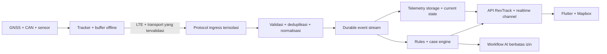

# RevTrack — IoT, integritas telemetri, dan keamanan kendaraan

Tanggal riset: **2 Oktober 2026 (Asia/Jakarta)**. Dokumen ini adalah rancangan engineering dan kriteria pengadaan. Nama perangkat merupakan kandidat evaluasi; dukungan kendaraan, sertifikat Indonesia, harga, stok, dan SLA belum dikonfirmasi melalui penawaran distributor. Target uji di bawah adalah usulan RevTrack, bukan klaim kemampuan vendor atau hasil pengujian yang sudah dilakukan.

## 1. Keputusan yang disarankan

Bangun **platform RevTrack sendiri, dengan tracker industri yang protokolnya bisa dikirim langsung ke server RevTrack**. Mulai dari dua atau tiga SKU, satu protokol utama, dan satu vendor pembanding. PCB custom masuk tahap berikutnya setelah data kegagalan instalasi dan unit economics tersedia. Dengan cara ini, kita memiliki data, pengalaman aplikasi, rules, AI, billing, dan hubungan pelanggan; ketergantungan perangkat menjadi hubungan pemasok komponen yang bisa diganti.

Mapbox menyediakan pengalaman peta. **Koordinat berasal dari penerima GNSS di kendaraan, bukan token Mapbox.** SIM/operator membawa telemetri ke server; Mapbox menampilkan armada, geofence, rute, dan konteks lokasi. Peta dapat tetap tampil ketika perangkat offline, tetapi posisi harus diberi label “terakhir diterima”, bukan “live”.

Prioritas awal: lokasi terpercaya, kualitas data terlihat, history lengkap, geofence, dispatch, pemeliharaan, laporan, dan deteksi anomali. Jangan menjual klaim “anti maling 100%”, “semua EV pasti terbaca”, atau “bukti pencurian bensin” hanya dari satu grafik sensor.

## 2. Tiga paket perangkat

| Paket | Isi awal | Cocok untuk | Hal yang harus dibuktikan |
|---|---|---|---|
| Track | Tracker hardwired LTE Cat 1, GNSS multikonstelasi, accelerometer, input ignition, backup battery, buffer offline, pemantauan tegangan | Rental mobil dengan kebutuhan lokasi dan operasional | Band operator, sertifikat SKU, sleep current, interval, ketahanan panas, tamper events |
| Insight | Track + pembacaan CAN/OBD sesuai kendaraan, driver ID, opsional sensor pintu/panic | EV dan ICE yang membutuhkan SOC/fuel/odometer | Matriks merek–model–tahun–varian–firmware, pemasangan aman, izin akses OEM bila diperlukan |
| Protect / Industrial | Insight + tracker sekunder independen, sensor khusus, gateway intercom terpisah bila diperlukan | Unit bernilai tinggi, truck, excavator, aset berat | Daya/baterai, enclosure, sensor dan kalibrasi, koneksi di site, SOP respons manusia |

OBD plug-and-play berguna untuk validasi data, namun mudah dilepas dan tidak menjadi satu-satunya lapisan proteksi aset. Hardwired juga dapat dirusak; perlindungan berasal dari beberapa sinyal, instalasi berkualitas, dan proses respons.

### Shortlist evaluasi, bukan pesanan pembelian

| Kandidat | Fakta yang dikonfirmasi dari sumber resmi | Posisi dalam pilot | Pertanyaan yang belum terjawab |
|---|---|---|---|
| Teltonika FMC150 | LTE Cat 1 dengan CAN processor terintegrasi; dokumentasi resmi menyediakan supported vehicle list | Kandidat utama kendaraan ringan dengan CAN | EV Indonesia mana dan parameter apa yang benar-benar didukung; TLS firmware; nomor sertifikat SKU Indonesia |
| Teltonika FMC003 | OBD LTE Cat 1; parameter OEM dan dukungan bergantung model kendaraan | Alat validasi CAN/OBD dan instalasi uji singkat | Kecocokan kendaraan lokal; perilaku sleep; risiko cabut; perbedaan varian ECU |
| Teltonika FMC650 | LTE Cat 1, J1939/J1708, antarmuka serial, backup battery; ditujukan juga ke heavy vehicle dan machinery | Kandidat truck, alat berat, sensor fuel industri | Enclosure untuk lingkungan instalasi, sensor yang disetujui, regional SKU, power budget |
| Queclink GV350CEU / GV355CEU | Katalog 2026 mencantumkan LTE Cat 1, CAN dan antarmuka aksesori pada seri terkait | Vendor pembanding agar platform tidak terkunci | SDK/protokol server, lisensi CAN, data EV, TLS, firmware lifecycle, SKU/band/sertifikat Indonesia |

Sumber: [FMC150 datasheet](https://wiki.teltonika-gps.com/images/6/64/DS-FMC150.pdf), [FMC150 dokumentasi dan compatibility](https://wiki.teltonika-gps.com/view/FMC150), [FMC003 deskripsi](https://wiki.teltonika-gps.com/view/FMC003_General_description), [FMC650 deskripsi](https://wiki.teltonika-gps.com/view/FMC650_General_description), [Queclink katalog 2026](https://www.queclink.com/wp-content/uploads/2026/02/2026-catalog.pdf).

Jangan memilih 2G-only untuk deployment baru. LTE Cat 1 menjadi baseline pilot; Cat 1 bis dapat dievaluasi bila SKU memenuhi seluruh kebutuhan. LTE-M/NB-IoT dan eSIM bukan otomatis lebih tepat: konfirmasi dukungan operator, mobilitas, cakupan rute, roaming, interval, dan kebutuhan voice. “Dual SIM” tidak berarti dua jaringan aktif bersamaan.

### Dokumen wajib dalam RFQ

1. Part number lengkap, revisi hardware, modem/band, firmware, masa dukungan, prosedur vulnerability reporting, dan proses RMA.
2. Sertifikat perangkat Indonesia yang dapat diverifikasi untuk model/revisi relevan; jangan menganggap CE/FCC menggantikannya.
3. Protocol specification, contoh payload, daftar I/O ID dan unit, fixture replay, konfigurasi endpoint sendiri, lisensi komersial decoder/CAN, batas vendor cloud.
4. Dukungan TLS dan verifikasi sertifikat yang benar-benar diuji; identitas unik per device; kemampuan rotasi konfigurasi/credential dan signed firmware jika tersedia.
5. Matriks vehicle compatibility untuk unit nyata milik rental, wiring/harness resmi, bukti no-DTC/no-battery-drain, dan dampak garansi yang disetujui installer/OEM.
6. Harga perangkat, harness, sensor, lisensi CAN, firmware management, instalasi, pajak, ongkir, minimum order, lead time, dan stok spare; pecah biaya satu kali dan berulang.

## 3. Data EV dan bensin: kemampuan harus eksplisit

Dokumentasi resmi FMC003 menyatakan parameter bergantung merek/model; daftar EV bahkan memisahkan SOC, range, SOH, suhu, arus, dan tegangan per kendaraan. Kehadiran konektor OBD bukan jaminan semua nilai tersedia. [Dokumentasi FMC003](https://wiki.teltonika-gps.com/view/FMC003_General_description), [contoh daftar dukungan EV resmi](https://wiki.teltonika-gps.com/images/e/ee/FMX003%2BFMX001%2BFMX00A_Supported_Vehicles_%28EV%29_20250703.pdf).

Gunakan tabel `vehicle_capabilities` sebelum membuka fitur di UI:

| Atribut | Contoh isi |
|---|---|
| Identitas | make, model, model_year, market, trim, VIN yang aksesnya dibatasi |
| Perangkat | tracker_model, hardware_revision, firmware_version, adapter_version |
| Signal | `ev.soc_pct`, `ev.soh_pct`, `fuel.level_pct`, `odometer_km`, `vehicle.speed_kph` |
| Bukti | supported / verified / unavailable / degraded, verified_at, installer, test_report |
| Asal | GNSS / CAN / OEM_API / calibrated_sensor / calculated / driver_reported |
| Kualitas | resolution, calibration_version, confidence, last_measured_at, stale_after |

`null` berarti tidak tersedia, bukan nol. UI menampilkan “SOC belum didukung” dan “odometer estimasi GNSS” dengan jelas. Jangan menamai GPS speed sebagai pembacaan speedometer; tampilkan keduanya ketika tersedia dan rekam perbedaannya.

### EV

- Ambil SOC/range dari CAN atau API OEM yang sah dan disetujui; jangan mengekstrapolasi SOC dari tegangan aki 12 V.
- Grafik: SOC terhadap waktu/km, sesi charge, idle energy, konsumsi kWh/100 km **hanya bila energi tersedia atau metode estimasinya dinyatakan**.
- SOH memerlukan sinyal yang valid atau model estimasi tervalidasi; bukan angka buatan dari usia kendaraan.
- Bedakan high-voltage battery dari aki aksesori 12 V. Tracker dipasang pada suplai low voltage yang sesuai oleh teknisi; tidak menyentuh high-voltage contactor, traction battery, rem, atau steering.
- Uji apakah pembacaan CAN membuat ECU terus bangun ketika parkir. Rancang polling/sleep menurut prosedur kendaraan, dan ukur arus diam.
- Integrasi charging station kelak memakai session meter/energy dan transaction identifier; perubahan SOC saja tidak sama dengan bukti kWh yang ditagihkan.

### ICE / diesel

- CAN fuel level sering merupakan bacaan dashboard dengan resolusi dan filter OEM. Itu berguna untuk tren, tidak selalu cukup untuk mendeteksi selisih kecil.
- Pemasangan probe fuel tambahan harus melalui spesialis untuk tangki dan jenis bahan bakar yang sesuai; jangan membuat instruksi drilling atau modifikasi tangki generik.
- Kalibrasi sensor per tangki, posisi, dan metode instalasi. Simpan versi kurva kalibrasi agar historis tidak berubah diam-diam.
- Deteksi refuel/drain menggabungkan level sebelum-sesudah, kendaraan stabil, waktu, lokasi, ignition, transaksi, struk, dan kapasitas tangki. Koreksi pengaruh kemiringan, gelombang cairan, sensor reset, dan interval sampling.
- Grafik memberi label `observed`, `estimated`, `driver_reported`, atau `disputed`. Ketidaksesuaian memulai kasus pemeriksaan; tidak otomatis menghukum driver.

### Alat berat

Gunakan profil aset, bukan memaksa semua unit menjadi mobil: engine hours, hydraulic/PTO hours bila tersedia, worksite geofence, attachment identity, maintenance by hours, payload bila sensor mendukung, dan pemakaian versus idle. J1939 menjadi kandidat interface; availability setiap SPN tetap diverifikasi. Pisahkan unit bertenaga, trailer, attachment, dan aset tanpa baterai. Pilih enclosure serta konektor sesuai lingkungan; tracker kabin IP41 tidak otomatis cocok ditempatkan di area terbuka. FMC650 mendokumentasikan pembacaan J1939 dan antarmuka aksesori, namun instalasi industrial tetap perlu evaluasi khusus. [FMC650 product specifications](https://teltonika-gps.com/products/trackers/fmc650).

## 4. Integrasi perangkat ke platform



Untuk pilot Teltonika, evaluasi Codec 8 Extended melalui adapter protokol tersendiri. Jangan mengasumsikan tracker dapat berbicara MQTT hanya karena backend memakai MQTT. Protokol resmi mendeskripsikan IMEI handshake, paket AVL, dan acknowledgement; identitas IMEI saja **bukan bukti autentikasi kriptografis**. [Teltonika data sending protocols](https://wiki.teltonika-gps.com/index.php?mobileaction=toggle_view_desktop&title=Teltonika_Data_Sending_Protocols).

Kontrak event minimum:

```json
{
  "schema_version": 1,
  "device_id": "internal-device-id",
  "event_id": "stable-ingress-event-id",
  "measured_at": "2026-10-02T02:10:00Z",
  "received_at": "2026-10-02T02:10:03Z",
  "location": {"lat": -6.2, "lon": 106.8, "fix_valid": true, "source": "gnss"},
  "speed_kph": 32.0,
  "speed_source": "gnss",
  "ignition": true,
  "external_power_v": 13.8,
  "ev_soc_pct": null,
  "fuel_level_pct": null,
  "quality": {"delayed": false, "suspected_replay": false},
  "raw_payload_ref": "restricted-evidence-object-id"
}
```

`tenant_id`, vehicle, dan pemasangan yang berlaku ditentukan server dari registry; jangan percaya tenant yang dikirim perangkat. Event lama harus dikaitkan ke vehicle installation pada `measured_at`, sehingga tracker yang dipindah kendaraan tidak mencemari history.

Perilaku ingestion yang wajib:

- Validasi frame length, CRC bila protokol memakai CRC, codec, batas field, timestamp, lat/lon dan panjang batch. CRC mendeteksi korupsi, bukan autentikasi.
- Simpan durably sebelum ACK sesuai semantics protokol. Terapkan deduplikasi saat device mengirim ulang; jangan menjanjikan “exactly once” dari jaringan.
- Event terlambat tetap masuk history, tetapi tidak boleh menggeser current location ke masa lalu.
- Jangan deduplikasi hanya berdasarkan timestamp: beberapa sensor/event bisa sah pada waktu sama. Gunakan sequence bila tersedia, payload hash, dan identitas record/protocol.
- Uji fragmented TCP frames, beberapa frame dalam satu read, reconnect, duplicated batch, malformed payload, jam perangkat salah, dan firmware tak dikenal.
- Pisahkan raw evidence, normalized telemetry, current state, dan business event agar decoder/rules dapat diperbaiki dan direplay.
- Buffer offline diuji dengan interval produksi nyata. Kapasitas dalam MB bukan janji “sekian hari” tanpa menghitung record size.

### Sampling dan kapasitas awal

Usulan profil: bergerak 10 detik dengan trigger belokan/perubahan kecepatan; parkir 5–15 menit; event power/tamper/geofence diprioritaskan. Mode insiden 2–5 detik boleh tersedia pada SKU yang lolos uji, dengan expiry otomatis dan budget SIM. Frekuensi sensing, penyimpanan, dan pengiriman adalah tiga hal berbeda.

Dengan 1.000 unit bergerak 10 jam/hari pada 10 detik dan parkir 14 jam pada 5 menit: **3.768 event/unit/hari, 3,768 juta event/hari**. Pada asumsi 200 byte payload/event, sekitar **22,6 MB/unit/30 hari** sebelum TLS/TCP, reconnect, metadata, firmware, dan komunikasi lain. Gunakan 2–4 kali headroom awal lalu ukur data SIM aktual; suara/video dihitung terpisah. Seluruh angka ini perhitungan perencanaan, bukan quote operator.

Kebutuhan konektivitas: enterprise SIM lifecycle API, paket pooling, usage alert, IMEI binding jika tersedia, destination restriction/private APN, dan coverage uji lintasan. Telkomsel mendokumentasikan API manajemen SIM serta opsi internet tujuan terbatas/private leased line; ketentuan komersial perlu ditawar langsung. Private APN membatasi jalur, tetapi tidak menggantikan autentikasi, enkripsi, atau otorisasi. [Telkomsel IoT Control Center](https://www.telkomsel.com/enterprise/product-list-iot/iot-control-center).

## 5. Mencegah manipulasi melalui bukti berlapis

| Risiko | Sinyal yang digunakan | Respons RevTrack | Batas yang harus terlihat |
|---|---|---|---|
| Power diputus / tracker dilepas | Power loss, backup battery, heartbeat, event unplug bila didukung | Buat kasus, simpan last good fix, cek tracker kedua, hubungi operasi | Battery habis atau jaringan putus bisa menunda alert |
| Mobil ditarik saat tidak aktif | Accelerometer + perpindahan + ignition off | Towing alert dengan konteks jadwal towing | Bukan otomatis pencurian |
| GNSS jam / hilang fix | Device interference flag bila tersedia, satellites/quality, CAN motion | Label lokasi tak terpercaya, tampilkan last valid fix dan cakupan ketidakpastian | Tidak dapat “tetap akurat” ketika sumber posisi terganggu |
| Dugaan spoofing | Lompatan mustahil, waktu berubah, speed CAN vs GNSS, ketidakcocokan tracker kedua | Quarantine posisi anomali, review bukti, tingkatkan incident priority | Multi-GNSS/dual-band tidak membuat perangkat kebal spoofing |
| SIM dipindah / device clone | Binding registry, credential, operator metadata, concurrent sessions | Tolak koneksi tidak sah, revokasi, investigasi | IMEI dapat dikirim sebagai string; jangan jadikan satu-satunya credential |
| Data diulang / dipalsukan | Timestamp, sequence bila ada, fingerprint payload, duplicate pattern | Tandai replay, rate limit, isolasi endpoint | Perangkat legacy mungkin tidak menandatangani tiap record |
| Bensin tidak sesuai struk | Fuel delta + stop + merchant/location + transaction + receipt | Kasus rekonsiliasi dan hak driver menjelaskan | Bukti berlapis memberi tingkat keyakinan, bukan vonis otomatis |
| Pergantian driver tidak sah | Assignment, driver ID, shift, device session | Alert assignment mismatch, verifikasi supervisor | Jangan pakai biometrik sebagai default |
| Penyalahgunaan admin | MFA, least privilege, audit, tenant isolation, approval sensitif | Batasi ekspor, review akses, revoke session | Administrator juga masuk threat model |

Sinyal jamming harus diverifikasi per model dan firmware. Dokumentasi vendor membedakan status gangguan GNSS, sedangkan referensi CISA mendiskusikan mitigasi gangguan dan spoofing; rancangan RevTrack memakai korelasi beberapa sumber, bukan menjanjikan sensor tunggal yang tidak bisa ditipu. [Teltonika contoh GNSS jamming](https://wiki.teltonika-gps.com/view/FMT100_Features_settings), [CISA panduan GPS equipment](https://www.cisa.gov/sites/default/files/documents/Improving_the_Operation_and_Development_of_Global_Positioning_System_%28GPS%29_Equipment_Used_by_Critical_Infrastructure_S508C.pdf).

Geofence memakai polygon versioned, accuracy margin, dwell time, dan hysteresis. Satu titik meleset dekat batas jangan menimbulkan rangkaian keluar-masuk. Event harus menyimpan geofence version, koordinat asli, kualitas fix, rule version, dan bukti waktu. “Vehicle stopped” tidak sama dengan “driver sedang istirahat”; status break memerlukan deklarasi/workflow driver atau kebijakan yang jelas.

## 6. Intercom dan kontrol kendaraan yang aman

Fitur “bicara langsung ke kendaraan” dirancang sebagai **intercom operasional yang diketahui pengguna**: speaker memutar pengumuman masuk, indikator sesi aktif, identitas operator, durasi terbatas, pembatasan volume, access log, dan tombol bicara driver. Auto-play audio satu arah dapat menjadi pilihan armada yang sudah diberi pemberitahuan. Mikrofon dua arah memakai aktivasi yang jelas; jangan membangun mode penyadapan kabin diam-diam. Recording dimatikan secara default dan memiliki tujuan serta retensi terpisah bila kemudian diperlukan.

Jangan menganggap tracker LTE Cat 1 otomatis mendukung panggilan suara, VoLTE, speaker, atau WebRTC. Gunakan gateway intercom otomotif terpisah yang tervalidasi, atau terminal driver dengan kebijakan aplikasi yang sesuai. Evaluasi echo/noise, jaringan buruk, pairing operator–kendaraan, sumber daya, dan keselamatan pengemudi. Ponsel yang kehilangan izin/background service tidak setara gateway kendaraan selalu menyala.

Untuk proteksi aset, prioritas fitur adalah incident response dan **pencegahan start berikutnya melalui jalur yang disetujui OEM/installer**, jika kelak dibutuhkan. Tidak ada pemutusan mesin, traction power, rem, atau kemudi ketika kendaraan berjalan. Fitur aktuasi bukan bagian dari starter aplikasi.

Sebelum suatu kontrol fisik ditawarkan, diperlukan safety case per model, bench test, closed-course test oleh teknisi, persetujuan operator berwenang, dua approver berbeda untuk tindakan sensitif, verifikasi kondisi terkini pada perangkat, command ID/expiry, respons ACK + konfirmasi efek, prosedur pembatalan, dan pemulihan lokal. Satu GPS speed = 0 atau status map bukan bukti kendaraan aman; offline/stale berarti tindakan ditolak. Model AI tidak boleh menjadi approver atau memegang akses langsung ke actuator.

Prinsip pemisahan interface telematika dari sistem kendaraan yang kritis mengikuti pendekatan keamanan berlapis dalam [NHTSA Vehicle Cybersecurity](https://www.nhtsa.gov/research/vehicle-cybersecurity). Ketentuan kontrol di atas adalah keputusan keselamatan RevTrack yang perlu dibuktikan melalui engineering, bukan klaim sertifikasi dari panduan tersebut.

## 7. Security lifecycle perangkat

- Provisioning di workbench: inventaris serial/IMEI/ICCID, bind tenant melalui enrollment terotorisasi, hapus credential default, pasang konfigurasi versi diketahui, rekam installer dan foto bukti instalasi dengan akses terbatas.
- Enkripsi transport: pilih TLS 1.2 atau lebih kuat sesuai kemampuan aktual; uji certificate validation dan expiry. mTLS menjadi preferensi jika model mendukung, bukan asumsi semua tracker bisa. Perangkat tanpa autentikasi kuat dibatasi ke jalur private tersegmentasi dan tidak diberi fungsi kontrol berisiko.
- Firmware: signed update jika tersedia, canary 1% → 10% → bertahap, health check, rollback yang didukung, dan jadwal saat kendaraan aman. Simpan hardware/firmware compatibility dan bukti perubahan.
- Backend ingress terisolasi dari aplikasi bisnis dan command service. Secrets di secret manager; larang public admin port, credential di repo, dan debug log berisi rahasia.
- Akses teknisi hanya unit yang ditugaskan dengan masa berlaku; aplikasi driver hanya kendaraan/shift sendiri. Semua pembacaan lokasi sensitif dan ekspor massal diaudit.
- Akhir sewa perangkat/decommission: hentikan SIM, cabut credential, tutup installation interval, hapus konfigurasi pelanggan sesuai kebijakan, dan catat custody.

Dokumentasi Teltonika menunjukkan dukungan TLS bergantung family/firmware dan membutuhkan konfigurasi sertifikat; karena itu kemampuan harus diuji per SKU. [Dokumentasi TLS vendor](https://wiki.teltonika-gps.com/index.php?mobileaction=toggle_view_desktop&title=FMB130_GPRS_settings). Untuk baseline pengadaan dan desain custom, gunakan identitas perangkat, konfigurasi, proteksi data, pembatasan interface, update, dan awareness status keamanan dari [NISTIR 8259A](https://csrc.nist.gov/pubs/ir/8259/a/final). Baseline ini panduan desain, bukan sertifikat produk.

### Bila kelak membuat hardware sendiri

Gate pertama: jumlah deployment dan biaya total membenarkan NRE, bukan hanya harga PCB terlihat murah. Program perlu engineer embedded/RF, automotive power protection, GNSS/LTE antenna design, secure element bila sesuai, signed boot/update, watchdog, offline storage yang tahan mati listrik, production key injection, traceability, EMC/RF/ESD/vibration/thermal testing, supply-chain alternative, battery handling, sertifikasi radio, fixture pabrik, dan support firmware sepanjang kontrak. ESP32 development board dapat membantu eksperimen sensor, tetapi bukan pengganti tracker automotive yang siap dikomersialkan.

Pembagian bahasa: Go untuk layanan bisnis/device registry; Rust untuk ingress dan parser protokol; Python untuk simulator, kalibrasi dan analitik; C++ untuk logika firmware/gateway bila SDK target mendukung, dengan C untuk BSP/HAL/driver vendor yang memerlukannya. Embedded Rust dipilih hanya setelah MCU, HAL, modem, debugging, dan jalur update tervalidasi. Pembelian tracker industri pada pilot tidak memerlukan kita menulis firmware baru. Batas modul, DSA, concurrency, dan pengujiannya dijelaskan dalam [engineering backend dan firmware](07-backend-engineering.md).

## 8. Indonesia: gate sebelum penjualan

| Area | Persiapan RevTrack | Bukti penutupan gate |
|---|---|---|
| Sertifikasi radio/perangkat | Verifikasi aturan terbaru, importir/pemegang sertifikat, SKU, label, dan sertifikat perangkat untuk distribusi Indonesia | Verifikasi pada kanal resmi dan konfirmasi tertulis pemasok/regulatory specialist |
| PSE dan badan usaha | Pemetaan kegiatan usaha, perizinan/OSS, evaluasi kewajiban pendaftaran platform komersial | Daftar kewajiban dan bukti registrasi yang berlaku |
| Data pribadi | Tetapkan controller/processor, tujuan, dasar pemrosesan, pemberitahuan driver, DPA pelanggan, retention, hak subjek, akses lokasi, dan insiden | Privacy review, kebijakan operasional, data inventory, deletion/export exercise |
| Pihak ketiga/cloud | Perjanjian prosesor, lokasi data, transfer lintas batas bila ada, subprocessor, prosedur akses/ekspor | Kontrak dan risk assessment yang sesuai deployment |
| Rekaman suara/kamera | Tujuan spesifik, disclosure yang jelas, akses terbatas, retensi minim, evaluasi proporsionalitas | Review terpisah sebelum aktivasi |
| Instalasi kendaraan | SOP teknisi, persetujuan pemilik, dokumentasi instalasi, dampak garansi, liability dan asuransi | Sign-off instalasi per unit dan dukungan service |

Rujukan resmi untuk pemeriksaan: [Permenkominfo 3/2024 tentang sertifikasi](https://jdih.komdigi.go.id/produk_hukum/katalog/892), [prosedur e-Sertifikasi](https://sertifikasi.postel.go.id/sertifikasi/informasi-sertifikasi/prosedur-sertifikasi), [FAQ PSE Privat](https://pse.komdigi.go.id/pertanyaan-umum), [UU 27/2022 Pelindungan Data Pribadi](https://peraturan.bpk.go.id/Details/229798/uu-no-27-). Kewajiban tepatnya perlu ditetapkan berdasarkan struktur usaha, jenis perangkat, dan pemrosesan nyata; jangan menyalin checklist umum menjadi klaim sudah patuh.

Lokasi yang terkait driver merupakan data yang sensitif secara operasional: minimalkan orang yang dapat melihatnya. Retensi awal yang diusulkan: raw telemetri 30–90 hari, history terkompresi sesuai kontrak, bukti kasus dengan legal hold terotorisasi, dan rekaman audio tidak disimpan secara default. Angka retensi adalah keputusan produk untuk ditinjau, bukan masa simpan yang diklaim diwajibkan undang-undang.

## 9. Pilot 20–30 unit dan acceptance criteria

Pilih kendaraan dari armada nyata: sedikitnya tiga tipe ICE, dua tipe EV jika tersedia, variasi tahun/trim, satu area sinyal buruk, dan beberapa unit parkir lama. Alat berat dapat menjadi pilot tersendiri agar scope awal tidak mencampur kebutuhan yang berbeda. Jalankan minimal empat minggu setelah bench test dan baseline kendaraan tanpa tracker.

| Uji | Target awal yang harus dibuktikan | Bukti |
|---|---|---|
| Lokasi live | p95 end-to-end ≤20 detik ketika jaringan sehat pada profil 10 detik | `measured_at`, `received_at`, waktu UI; pisahkan latency offline |
| Akurasi | Tetapkan target open-sky dan urban terpisah; contoh pilot p95 open-sky ≤15 m terhadap reference yang disepakati | Dataset rute dan reference; jangan menilai dari map matching saja |
| Outage | Setelah 2 jam offline, 100% event yang diproduksi test fixture diterima/dideduplikasi setelah reconnect sesuai kapasitas buffer | Counter fixture/device dan server, replay report |
| Power loss | Event terdeteksi; alert <30 detik ketika jalur data tersedia | Video/workbench timestamp, notification receipt |
| Backup | Daya tahan terukur memenuhi durasi paket yang dijual pada profil aktual | Discharge test, suhu, battery age; jangan hanya memakai mAh |
| Tidur/aki | Tidak memicu wake-lock ECU; arus diam dan aki lolos batas installer/OEM | Multimeter/logger dan parked soak test |
| CAN / EV | 100% signal yang dijual pada model tersebut diverifikasi; unavailable tetap null | Pembandingan dashboard/diagnostic source dan laporan signed installer |
| Geofence | Deteksi valid sesuai margin/dwell; target false alert disepakati sebelum uji | Replay rute batas, tunnel, multipath dan overnight parking |
| Fuel | Sensitivitas dan false positive terukur pada kalibrasi nyata, termasuk miring/refuel kecil | Ground truth liter/transaksi, bukan sekadar perubahan grafik |
| Akses | User lintas tenant tidak dapat baca lokasi, command, export, atau websocket unit lain | Automated authorization tests dan security review |
| Recovery | Restore data/config diuji; device revoke/decommission berhasil | Drill report dengan waktu dan owner |
| Driver fairness | Anomali dapat ditinjau, dikoreksi, dan dibantah dengan audit utuh | User acceptance oleh operator dan perwakilan driver |

Tidak ada pengujian jammer/spoofer di jalan umum. Gunakan simulasi payload, dataset, atau laboratorium RF berizin dengan lingkungan terkendali. Tidak ada eksperimen actuator pada kendaraan aktif di jalan.

## 10. Operasi, biaya, dan urutan eksekusi

TCO per unit/bulan = amortisasi perangkat + pemasangan + SIM + ingestion/storage + peta + notifikasi + dukungan/onsite + cadangan RMA + biaya lisensi khusus. Audio/video, sensor fuel, dan tracker kedua adalah add-on dengan biaya sendiri. Tetapkan margin dari quote dan pengukuran pilot, bukan dari harga tracker online saja.

Tim minimum mencakup owner IoT/embedded, teknisi otomotif, backend ingestion, mobile, security/operations, dan support pelanggan. AI membantu triage perangkat offline, ringkasan insiden, prediksi servis berbasis data yang tersedia, dan rekonsiliasi fuel; manusia tetap mengesahkan tindakan keselamatan dan tindakan yang berdampak pada driver.

Urutan kerja yang bisa dimulai sekarang:

1. Inventaris 20–30 VIN/model/year/trim dan lokasi operasi; tandai kebutuhan SOC/fuel per unit.
2. RFQ dua vendor dan satu operator; minta bukti endpoint sendiri, compatibility, sertifikat, biaya, dan firmware support.
3. Beli sample melalui proses pengadaan perusahaan; bench test dan integrasikan satu protokol ke server uji.
4. Instal 5 unit dahulu; ukur power, GNSS, coverage, sleep dan data quality sebelum memperluas.
5. Pilot empat minggu; tampilkan capability dan confidence di aplikasi; tutup gap sebelum menjanjikan fitur kontraktual.
6. Perluas ke 100 unit dengan observability, spare stock, runbook insiden, installer training, billing, dan export pelanggan.
7. Naik ke 1.000+ setelah soak/load test, failover drill, tenant isolation review, dan service economics lolos. Custom hardware, intercom, dan kontrol start memiliki gate engineering tersendiri.
