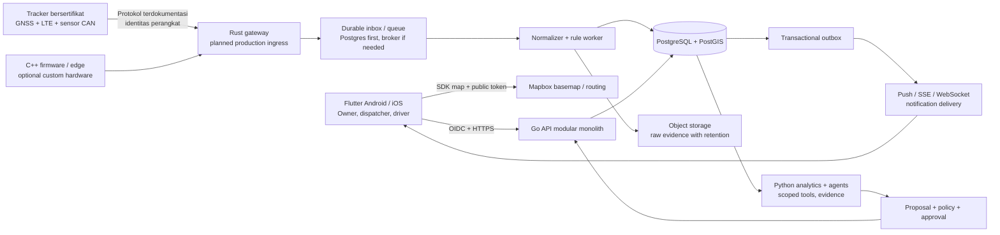
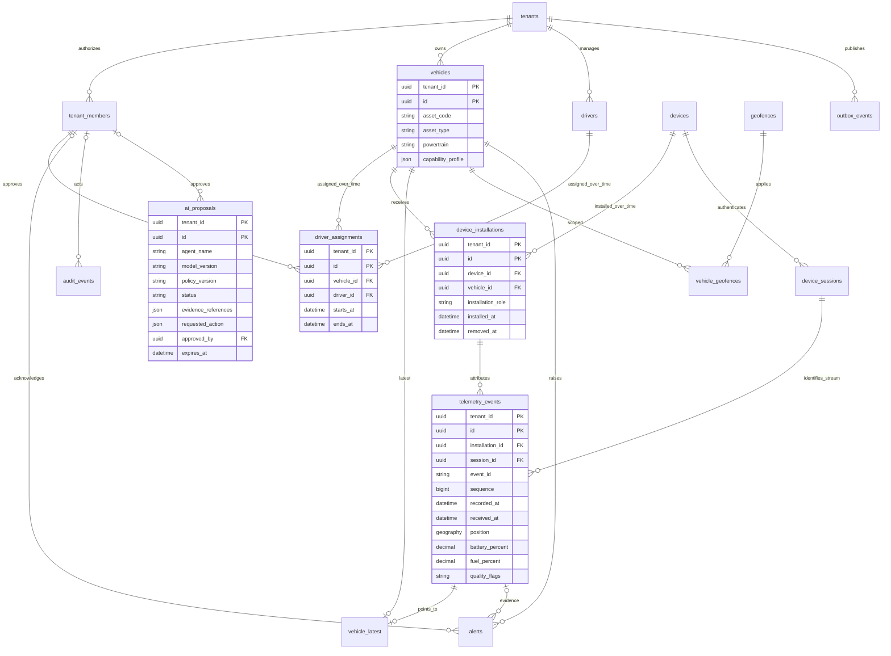
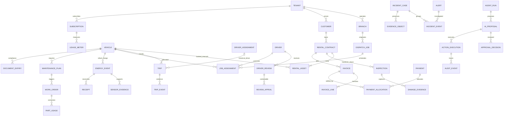

# Arsitektur, ERD dan kontrak data RevTrack

Dokumen desain awal, 2 Oktober 2026. Targetnya platform rental/fleet B2B multi-tenant untuk EV, kendaraan bensin/diesel dan alat berat, dengan jalan pengembangan menuju marketplace/dispatch. Kemampuan bisnis lengkap di bawah adalah blueprint; implementasi saat ini sengaja ditandai terpisah.

## 1. Keputusan arsitektur

Mulai dengan **modular monolith Go** untuk identitas tenant, armada, pengemudi, rental, alert dan billing. Gunakan PostgreSQL + PostGIS sebagai sumber kebenaran bisnis. Pisahkan proses penerimaan telemetry saat protokol perangkat dan beban memerlukannya: **Rust** untuk koneksi/protocol parsing/normalisasi, **Python** untuk analytics/model evaluation/AI orchestration, dan **C++** untuk firmware atau edge pada hardware yang benar-benar kita kendalikan. Empat bahasa memiliki batas tanggung jawab jelas; MVP tidak memerlukan empat service kosong.

Mapbox merender peta, geocoding dan rute sesuai layanan yang dipilih. **Posisi kendaraan berasal dari tracker**, bukan token Mapbox. Data telematics, tenant dan biaya rental tetap di backend RevTrack. Peta viewport/cluster mengambil latest positions; jangan kirim raw history seluruh armada ke ponsel.

Broker durable menjadi keputusan berdasarkan beban terukur, bukan syarat MVP. NATS JetStream adalah kandidat: consumer dengan acknowledgment dan redelivery tetap membutuhkan handler idempoten karena pengiriman ulang dapat terjadi. Dokumentasi resmi: [JetStream consumers](https://docs.nats.io/learn/jetstream/pull-consumers). Jangan mengklaim “exactly once end-to-end” hanya karena menggunakan broker.

## 2. Status nyata repository

| Komponen | Yang sudah berupa kode | Yang belum |
|---|---|---|
| Go API demo | Auth token lokal terpisah user/device, tenant isolation, fleet/history, validation, replay guard, geofence rectangle, overspeed, acknowledge, assignment, booking/return, work order/complete, audit | OIDC, API publik production, database adapter, kontrak/deposit/invoice/pembayaran, delivery push/SSE/WebSocket |
| Storage demo | Ring buffer bounded, opsi snapshot JSON atomic rename + restart replay cursor | HA, encrypted data-at-rest managed, replication, power-loss guarantees, concurrent multi-process writers |
| SQL foundation | 16 tabel + composite tenant FK, RLS, geospatial indexes, assignment overlap constraint | Belum dipasang ke Go; PostGIS integration test dan migration runner belum tersedia |
| Rust / Python / C++ | Pembagian modul dan kontrak pada blueprint | Binary gateway, agent runtime, model terlatih, firmware produksi belum dibuat |
| Hardware commands | Tidak ada | Safety engineering, OEM compatibility, command approval, device acknowledgment perlu proyek terpisah |

API dan widget dapat diuji dengan data simulasi. Hal tersebut bukan bukti bahwa SOC EV, fuel level, ignition, odometer atau speaker bekerja pada setiap model kendaraan. Capability profile per VIN/model/year/device menentukan field yang tersedia; `null/unknown` harus tampil eksplisit.

Flow bisnis Go yang dapat dijalankan: booking unit tanpa benturan jadwal → return → work order inspeksi → complete → booking berikutnya. Konflik di-check atomik dan semua langkah tercatat dalam audit; snapshot opsional mempertahankan state setelah restart. Ini belum mencakup tanda tangan kontrak, payment gateway, deposit, inspeksi foto atau dokumen komersial. Jadwal memakai interval `[start,end)` dan pengembalian masa depan ditolak. Data booking/work order tetap merupakan koleksi demo, belum tabel SQL.

## 3. Aliran telemetry dan invariant

1. Provision perangkat: inventaris hardware, ownership tenant, credential unik, capability profile dan pemasangan tervalidasi. Riwayat instalasi menghubungkan perangkat dengan kendaraan dalam interval waktu; pindah alat tidak boleh memindahkan history lama ke mobil baru.
2. Gateway mengautentikasi **identitas perangkat**, memetakan tenant/installation, memvalidasi framing/ukuran/CRC sesuai protokol, dan memberi `received_at`. Tenant/vehicle ID dalam payload perangkat tidak dipercaya.
3. Normalisasi envelope versi: `tenant_id` internal, `device_id`, `installation_id`, `session_id`, `event_id`, `sequence`, `recorded_at`, `received_at`, `schema_version`, unit SI/konversi terdokumentasi, accuracy dan quality flags. `raw_payload_sha256` menghubungkan data normal dengan evidence mentah.
4. Persist durable sebelum acknowledgment yang menjanjikan penerimaan. Offline replay masuk history; dedup `(tenant,device,session,sequence)` dan stable event ID. Reboot perangkat membutuhkan session/epoch yang terverifikasi, tidak sekadar reset sequence dari payload.
5. Dalam transaksi: insert history, update latest **hanya bila cursor lebih baru**, buat event rule/outbox idempoten. Timestamp GPS dan reception time terpisah. Late event boleh mengisi grafik/trip setelah rekonsiliasi tetapi tidak menggeser ikon kendaraan mundur.
6. Rule engine menggunakan hysteresis/dwell, sensor uncertainty dan correlation. GNSS jump/offline/power loss adalah **indikasi**, bukan vonis pencurian. Setiap alert menyimpan evidence, versi rule, confidence, acknowledgment dan hasil investigasi.
7. Delivery push bersifat tambahan; inbox server menjadi sumber status alert. Client punya reconnect cursor, stale badge, backoff dan fallback refresh. Metrik `recorded_at→received_at→processed_at→visible_at` membedakan koneksi lapangan dari keterlambatan backend.

Demo saat ini menolak event lama sepenuhnya, memiliki satu device simulator utama dan tidak menerima MQTT/TCP binary. Produksi harus menambahkan path historical-late yang teruji. Untrusted receipt/OCR/chat/device labels tidak boleh menjadi instruksi bagi agent.

## 4. ERD fondasi SQL yang tersedia

Semua entitas domain memiliki primary key komposit `(tenant_id,id)` kecuali tabel relasi/latest; seluruh FK domain membawa tenant yang sama. UUID produksi berbeda dari ID fixture `veh-001`. Nama pada diagram sesuai migration, dengan kolom ringkas.

`driver_assignments` memakai range exclusion agar satu pengemudi atau kendaraan tidak memiliki jadwal bertumpuk. `device_installations` mencegah interval perangkat yang tumpang tindih; pemasangan primary aktif tunggal per kendaraan. Timestamp validitas session/installation masih harus diverifikasi aplikasi: foreign key memastikan identitas, bukan semantik waktu.

`FORCE ROW LEVEL SECURITY` dipasang tetapi superuser/role `BYPASSRLS` tetap melewati RLS. Integrity checks juga bukan pengganti scoping FK. Runtime wajib role terbatas; tenant context ditentukan membership terverifikasi dan `set_config(...,true)` dalam transaksi. [PostgreSQL RLS](https://www.postgresql.org/docs/current/ddl-rowsecurity.html).

PostGIS GiST dipakai untuk kandidat lokasi/geofence, lalu predicate geometri presisi. `ST_Covers` cocok ketika titik tepat pada batas dianggap masih di dalam; boundary policy tetap harus disepakati, ditambah buffer ketidakpastian dan dwell. [PostGIS ST_Covers](https://postgis.net/docs/ST_Covers.html).

## 5. ERD bisnis lengkap — tahap lanjutan

Diagram berikut adalah **desain konseptual**, bukan klaim tabel sudah dimigrasikan. Setiap tabel tetap tenant-scoped, audit actor jelas, dan dokumen sensitif tersimpan sebagai object reference terenkripsi.

| Modul | Data/kunci yang perlu dimiliki | Invariant penting |
|---|---|---|
| Rental | customer, contract, asset interval, deposit, pricing version, extension, return/inspection | Tidak double-booking; perubahan tarif memiliki versi; check-in/out menyimpan odometer dan evidence kondisi |
| Driver | identitas minimum, SIM/expiry, assignment timeline, shift, inspection log, review/appeal | Data lokasi/rating diakses sesuai tugas; skor tidak menghukum otomatis; pengemudi dapat memberi konteks |
| Dispatch | job, origin/destination, time window, required skill/capability, capacity, assignment | Driver/unit available, baterai/fuel cukup dengan uncertainty, jam kerja, otorisasi tenant/branch |
| Trip | ignition transitions, movement windows, distance source, start/end, idle, replay gap | Speed GPS berbeda dari instrument cluster/CAN; gap/offline tidak diisi sebagai fakta |
| Energi EV | SOC, pack voltage/current bila didukung, charging session kWh, charger ID, tariff, estimated range | SOC bukan state-of-health; range adalah estimasi; provenance/umur sensor tampil; OEM mapping per model |
| Fuel | level terkalibrasi, delta/refill candidate, receipt/OCR, lokasi stasiun, transaksi | Slosh/kemiringan/sensor drift diperhitungkan; kuitansi bukan bukti final; kombinasi evidence + review |
| Maintenance | mileage/engine-hour/calendar plan, DTC, work order, parts, supplier, downtime | Pemicu per asset; engine-hour alat berat tidak diganti odometer; AI memberi diagnosis kandidat |
| Billing | invoice/line, tax profile, credit note, payment/allocation, ledger reference | Nilai uang integer minor-unit atau decimal fixed; currency eksplisit; perubahan lewat adjustment, webhook idempoten |
| Security case | alerts, state timeline, evidence hash/reference, investigator, export access | Bukti diberi confidence, chain-of-custody dan retention; tidak langsung menyimpulkan fraud dari satu sinyal |
| SaaS | subscription, tenant entitlements, active-device meter, quota, support cases | Isolasi biaya dan data; akses support time-bound/audited; ekspor data dan offboarding jelas |

Financial transaction, duplicate payment, rental overlap, driver availability dan remote command harus menggunakan transaksi/lock/unique constraints yang sesuai. Cache hanya mempercepat query; tidak menjadi satu-satunya pengaman invariant bisnis.

## 6. Agent runtime dan batas tindakan

“Sub-team AI” adalah service dengan tool permissions, bukan model yang bebas mengakses database/kendaraan. Rekomendasi tim: Fleet Ops (ringkasan/triage), Dispatch Planner (proposal penugasan), Energy Analyst (anomali/rekonsiliasi), Maintenance Planner (prioritas servis), Revenue Auditor (selisih kontrak/tagihan), Security Investigator (timeline evidence) dan Supervisor (budget/routing/escalation). Runtime bermodel state machine: `observe → gather evidence → propose → policy check → approve if required → execute scoped tool → verify → audit`.

Tool read-only dibatasi tenant/branch dan field pribadi. Proposal harus menyimpan model/prompt/policy version, sumber bukti, uncertainty, expiry, cost/token budget dan hasil evaluasi. Tulisan bebas/OCR/log perangkat diperlakukan sebagai data tidak tepercaya. Perubahan assignment, uang, suspend driver atau pesan ke pelanggan memerlukan izin operasional eksplisit; tindakan safety-critical memakai approval/engineering gate terpisah. Tidak ada AI auto-immobilize.

Kriteria manfaat: waktu triage menurun, proposal diterima operator, false alert terkendali, dan kesalahan dapat diaudit. Jangan menjanjikan model mendeteksi semua pencurian; ukur precision/recall per jenis kasus pada data berlabel dan berizin. Gunakan eval suite dengan evidence hilang, spoofed packet, receipt palsu, tenant cross-access, prompt injection dan sensor disagreement sebelum tool write diberikan.

## 7. Kapasitas, operasi dan acceptance produksi

Contoh sizing **asumsi perencanaan**, bukan benchmark: 10.000 tracker setiap 10 detik ≈1.000 pesan/detik atau 86,4 juta/hari jika semuanya aktif 24 jam. Pada 500 byte normalisasi ≈43,2 GB/hari payload sebelum indeks/replica/WAL/raw. Skema interval adaptif (moving lebih sering, parked heartbeat lebih jarang) dan retensi berlapis sangat memengaruhi biaya. Ukur proporsi moving, ukuran payload protokol dan offline burst dari pilot.

Gunakan index `(tenant,vehicle,recorded_at)`, latest cache/table terpisah, viewport query + clustering, pagination cursor dan downsampling grafik min/max/mean tanpa membuang puncak. Hot telemetry dipartisi setelah unique/dedup design benar; object storage menyimpan raw evidence terkompresi dengan kebijakan akses. Reconnect 10.000 perangkat sekaligus perlu bounded queue, backpressure, fairness tenant, rate limits dan load-shedding yang jelas.

Release produksi memerlukan: hardware matrix lulus, penetration/tenant tests, replay/offline burst tests, DB migration integration tests, backup restore drill, monitoring lag/queue/DLQ, on-call playbook, pembatasan biaya vendor, data-retention deletion test, dan SOP recovery mobil dengan operator. Target awal yang harus divalidasi saat pilot: lokasi online terlihat p95 <10 detik pada interval laporan 5 detik dan jaringan memadai; p95 API read <500 ms pada beban agreed; availability dan RPO/RTO ditentukan dari tier layanan serta kapasitas tim. Jangan menampilkan SLA sebelum ada pengukuran dan mekanisme pendukungnya.

Dokumen engineering Go/Rust/Python/C++, algoritma dan concurrency: [Backend engineering](07-backend-engineering.md). Kontrak implementasi demo: [API README](../services/api/README.md). Skema dan batas verifikasi: [Database README](../db/README.md).
